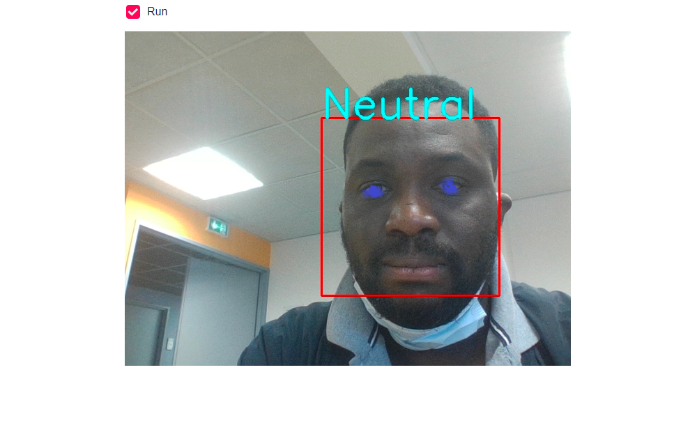
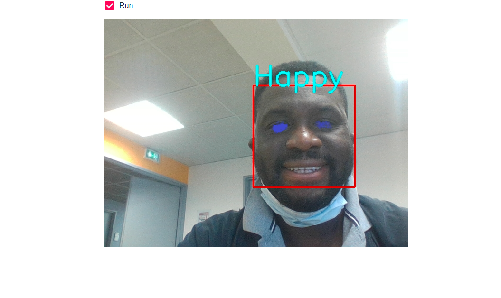
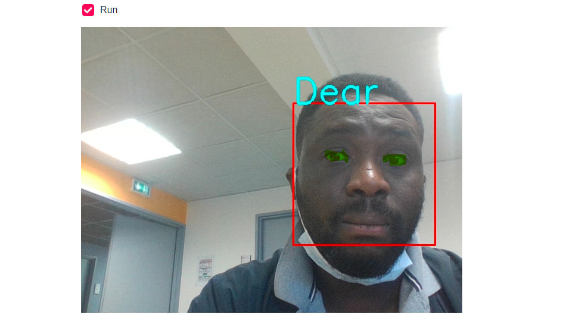
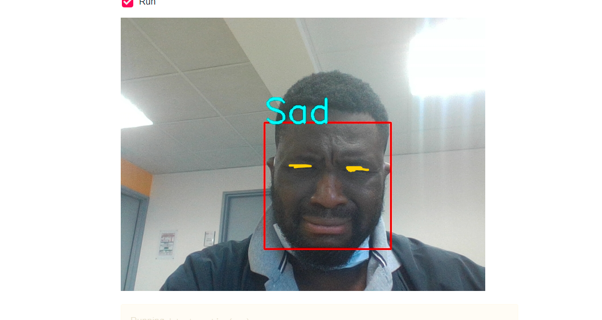

# Emotion_detection

# Contexte du projet

Les expressions du visage peuvent naturellement servirent à évaluer la satisfaction d’un client aux prises avec un service après-vente ou à face à un produit récemment acquis dont il s’agit de comprendre le fonctionnement. On peut encore mentionner les applications suivantes :

La détection d’un manque d’attention chez un conducteur en vue d’augmenter la sécurité de la conduite.
L’évaluation du niveau de stress de passagers à l’atterrissage ou à l’arrivé en gare ou la détection de comportements suspects.
L’humanisation des robots dans leurs interactions avec les humains dont ils prendraient en compte l’état psychique.


# Modalités pédagogiques

Le projet se fait en groupe (2 ou 3 personnes).

# Critères de performance

Le code doit bien être structuré, avec des explications sur le choix de l'architecture utilisée dans le modèle et une évaluation de la performance du modèle.

# Modalités d'évaluation

Un rapport sur le projet réalisé qui explique les différentes étapes du code

# Description des données

Présentation de l'architecture utilisée

Conclusion (avantages et inconvénients, concurrents, recommandations…)

Revue de code avec le formateur.

Après la finalisation du projet avec son rapport, une présentation ppt pourra être demandé des différentes étapes du projet, une explication du code et une demo.

# Livrables

- Un lien Github vers le code python de l'interface graphique. 

- Cette interface permet de reconnaitre l'émotion d'une personne à travers une image où bien une Webcam.

- Elle permet aussi d'associer un emoji qui représente l'émotion de la personne dans l'image/vidéo

- Finalement, elle va lui poser des questions si l'émotion est négative (ex. pourquoi es-tu triste, ...), si l'émotion est positive elle va la féliciter.

# Choix du modèle

# Lancement des applications

Installation:
```
pip install -r requirements.txt
```
Lancer:
```
streamlit run photo_detect_emotions.py

streamlit run webcam_detect_emotions.py

```

# Résultats

J'ai limité à 100 Epoch et j'ai obtenu une précision de 83 % pour le modèle.







